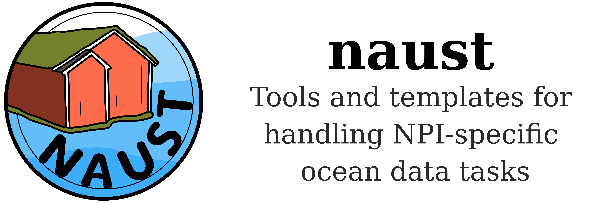

Collection of various Python functions, templates etc for working with oceanography data specific to the [Norwegian Polar Institute](https://www.npolar.no/en/) (NPI).

The idea is more in-house specific things can live here, but more truly general stuff can live in [kval](github.com/NPIOcean/kval).

Example of things to put here:

- Parsers for specific file formats.
- NPI-specific metadata fixing.
- Salinity QC.
- Log sheets, excel sheets and associated parsers or converterts.

____

Maintained by the Oceanography section at NPI.
____

**STATUS**

- *09.04.25*: Initialized. Planning to build a quick loading module for dealing with Fram Strait bottle data.